# [node-red-contrib-prib-functions][2]

[Node-Red][1] nodes for various functions:

* Data Analysis  - statistical metrics that has real time option
* Matrix
* Transform
* Test
* Load Injector
* Monitor Flow
* append
* Spawn Process
* Host Available
* node.js os metrics
* Levenshtein Distance
* DC DLLM - Decision-Centric Design for LLM Systems

------------------------------------------------------------

## Data Analysis

Real time metrics which are recalculated on single of data point and posted in msg.result.
Key and value can be selected from msg.payload. Includes lag (seasonal) along with delta(defference).
Sending message with topic"@stats" places message with all stats on second port.
If realtime metrics then a third port is shown where the message is sent if it is an outlier
being outside 3 standard deviations from mean. This can be changed to median and number of deviations.

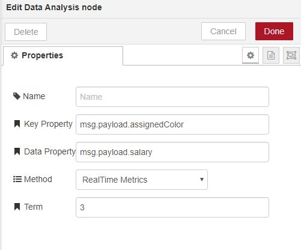
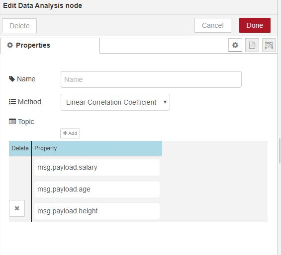

A set of data analysis functions that can be run over an array of data

Single value metrics:

* Autocorrelation
* Autocovariance
* Average/Mean
* Maximum
* Median
* Minimum
* Range
* Standard Deviation
* Skewness
* Sum
* Variance

Array metrics:

* Deltas
* Deltas Normalised
* difference
* difference seasonal
* difference seasonal second order
* Moving Average Simple (SMA)
* Moving Average Cumulative (CMA)
* Moving Average Weighted (WMA)
* Moving Average Exponential (EMA/EWMA)
* Normalise
* Standardization (Z-score Normalization)

Array data

* distances
* distance(s) minimum between points
* distance(s) maximum between points

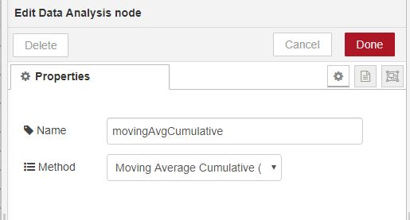

example:

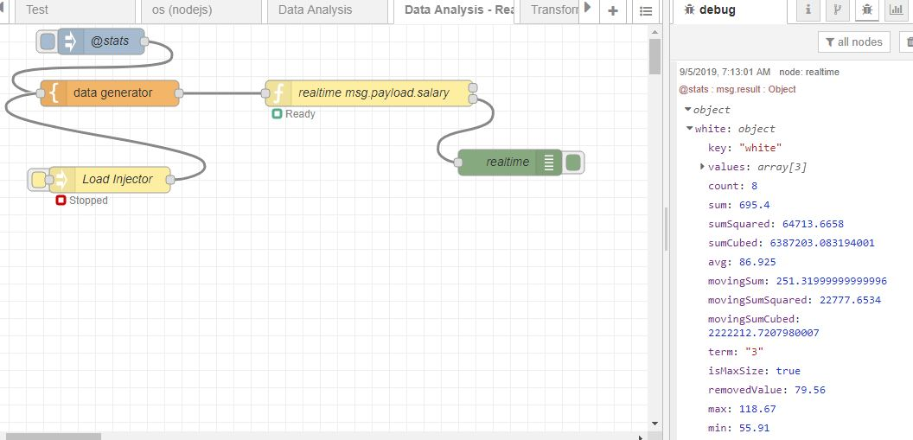

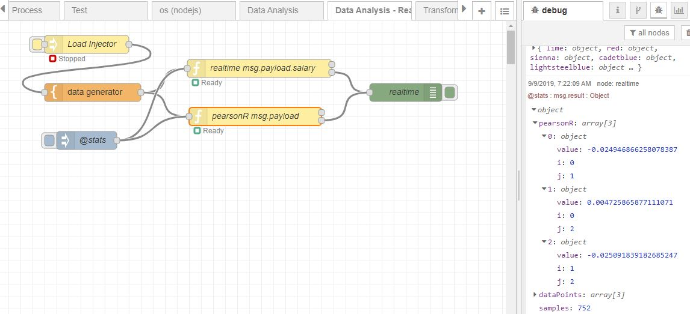

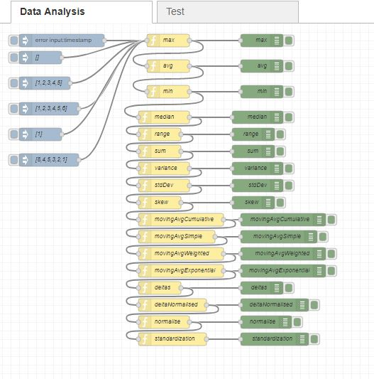

------------------------------------------------------------

## logistic regression

Perform logistic regression by setting up model with fit then using the model in other nodes to do prediction probability or class
------------------------------------------------------------

## columnar store

Store data into a columnar store with sql select access

------------------------------------------------------------

## Matrix

Define a matrix and perform various functions

* Define / Define Empty / Create / Create Like/ clone
* Add / Add Row to Row / Add to Cell / Add Row / Subtract Cell
* Multiple / Multiple Cell / Divide Cell / Divide Row
* Transpose
* Adjoint
* Cofactor
* Complement Minor
* Identity
* Inverse
* Determinant
* Backward Substitution
* Forward Elimination
* Gaussian Elimination
* Reduced Row EchelonForm
* Row Echelon Form
* Nearly Equals / Is Square / Get Cell
* Sum Row
* Swap Rows
* To Array Object

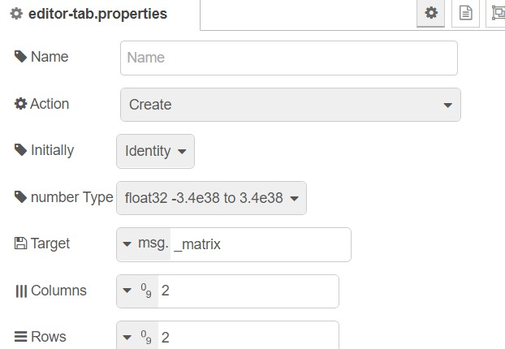

------------------------------------------------------------

## Transform

Translates a selected msg property to a target property.
Messages generates a message for each row or record.

Transformations:

* Array to
  * CSV
  * HTML
  * ISO8385
  * Messages
  * xlsx / xlsx object (excel uses [xlsx][7])  
* AVRO to JSON (uses [avsc][6])
* Buffer to compressed
* Confluence to JSON
* Compressed to
  * Buffer
  * String
  * JSON
* CSV to
  * Array
  * HTML
  * Messages
* CSVWithHeader to
  * Array
  * HTML
  * JSON
* Date to
  * is between
  * ISO string
  * locale string
  * range limit
* ISO8385 to Array
* ISO8385 to JSON
* JSON to
  * Array
  * Confluence
  * CSV
  * AVRO (uses [avsc][6])
  * ISO8385
  * Messages
  * String
  * xlsx / xlsx object (excel uses [xlsx][7])  
  * XML (uses [fast-xml-parser][4])
* Number
  * is between
  * range limit
* path
  * Basename
  * Dirname
  * Extname
  * Format
  * Is Absolute
  * Join
  * Parse
  * Normalize
  * Resolve
* snappy compress (uses [snappy][5], must install separately)
* snappy uncompress (uses [snappy][5], must install separately)
* String to
  * Append
  * Array By Delimiter
  * At
  * Camelize
  * Capitalize
  * Compressed
  * Char At
  * Char Code At"
  * Code Point At
  * Concat
  * Date
  * Delimiter On Case
  * _ to space
  * _ to space Capitilize
  * Drop square bracket prefix
  * Ends With
  * Float
  * Get Word
  * Integer
  * is Between
  * Lower Case
  * Number
  * Prepend
  * JSON
  * Range Limit
  * Split
  * Starts With
  * Timestamp
  * Title
  * Title Grammatical
  * Trim
  * Trim End
  * Trim Start
  * Upper Case
  * Xml String Encode

* xlsx / xlsx object to array/JSON (excel uses [xlsx][7])  
* XML to JSON (uses [fast-xml-parser][4])

Note, snappy needs to be installed separately as can have issues with auto install as build binaries.

With xlsx object one can use the function in [xlsx][7] against the object in functions node.
"
Example AVRO with schema

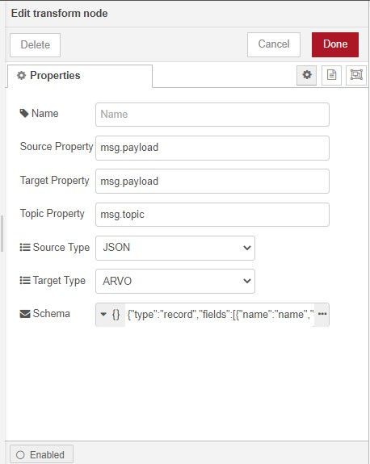

For Confluence schema contains a list of schemas in form {"\<schema id\>",\<schema\>}

------------------------------------------------------------

## Test

Allows a test case for a message to allow simple testing of nodes. Injects a new message via mouse or message. Message sent to first port which can be consumed by other nodes and returned back to node in a loop. The Test node then checks against detailed expected payload result.

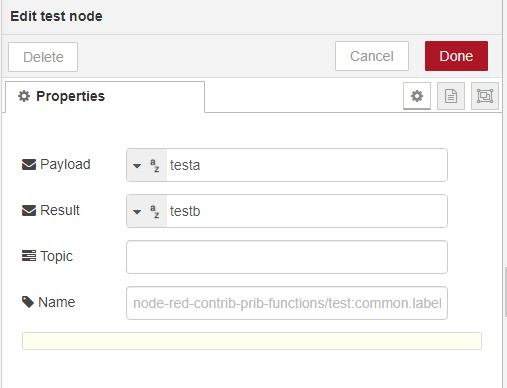

example:

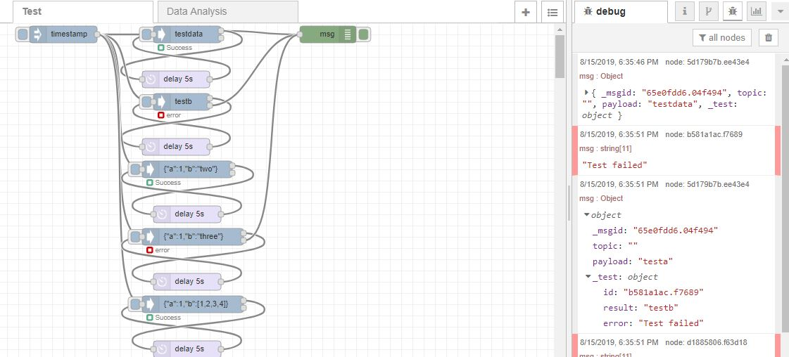

after run

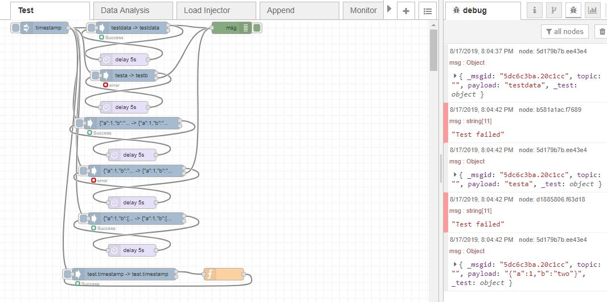

------------------------------------------------------------

## append

Append file(s) to payload. Cached to maximise performance.
Require can be used to find file.

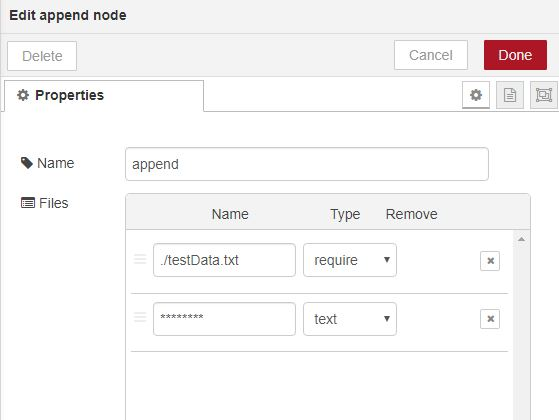

Test example:

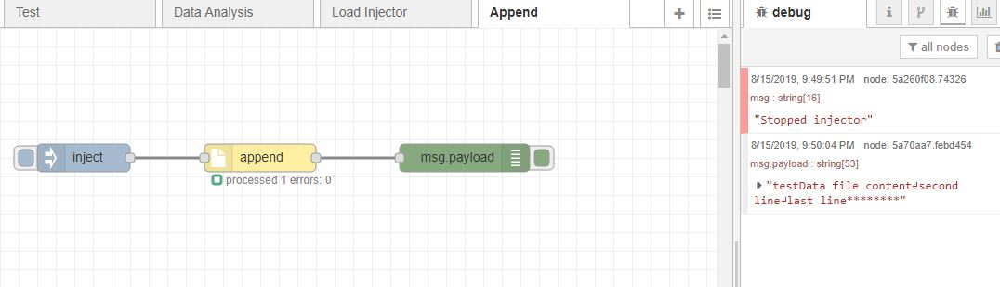

------------------------------------------------------------

## Levenshtein Distance

The levenshtein distance between two character strings.

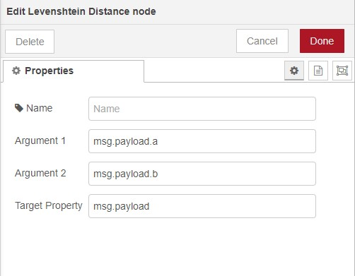

------------------------------------------------------------

## Load Injector

Inject messages for a set period of time with varying think time.
Primary purpose is testing and useful for load/stress testing.

Has 3 extra data types

1. generated id - Unique id for each message
2. generated data - string text generated using [dummy-json][3]
3. generated json - json generated using [dummy-json][3]

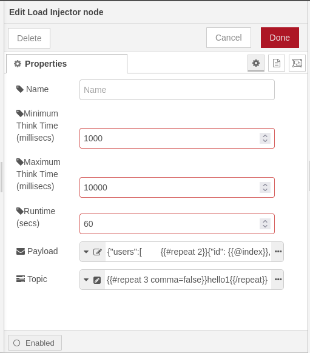

Test example:

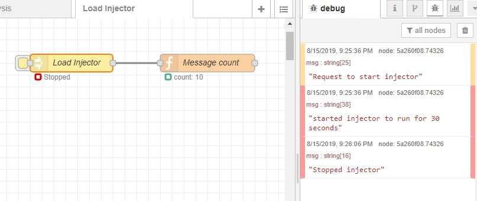

------------------------------------------------------------

## Monitor Flow

Add on wire between two flows to see message rates in status line.
Rate sampled every second and provides rate last second / 10 seconds / 1 minute / 5 minutes.

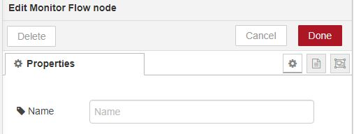

Test example:

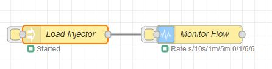

------------------------------------------------------------

## Host Available

Test if host is available sending msg to up or down port so action can be taken.
Message only sent on state change or if message is sent which doesn't have topic refreshHostAvailable.
This topic forces a check rather than time check which can be set.

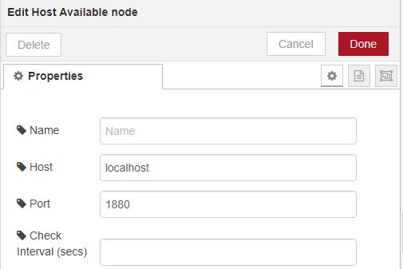

Test example:

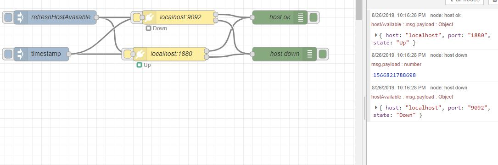

------------------------------------------------------------

## Monitor System

System monitoring metrics

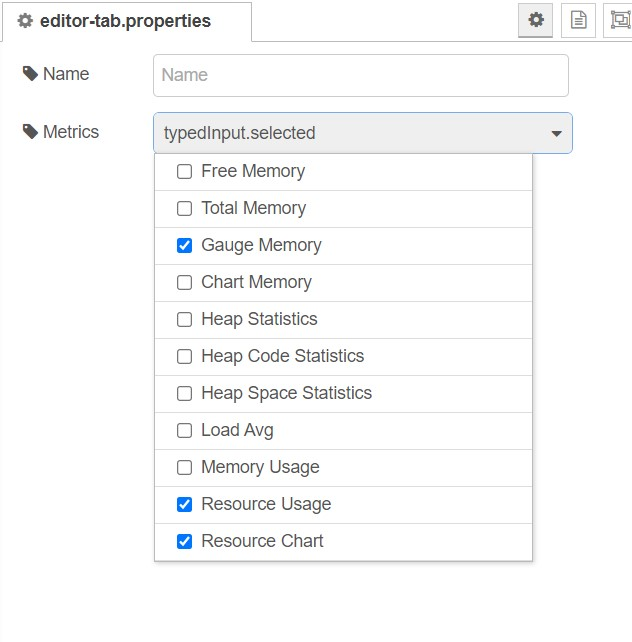

Test example:

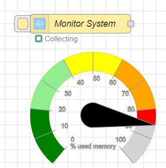

------------------------------------------------------------

## os

The metrics from node.js os

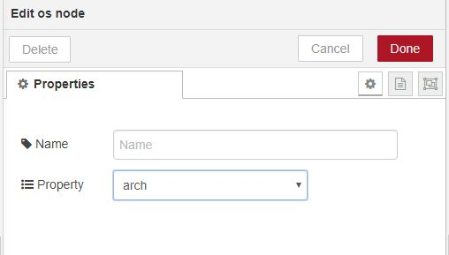

Test example:

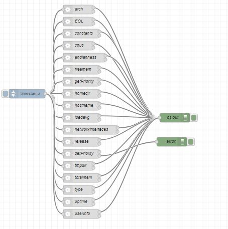

------------------------------------------------------------

## Spawn Process

Spawn process as per node.js manual with ability to set working directory, environment variables
and argument passed to process. STDOUT and STDERR are sent as individual messages.
RC port is sent a message on closure.
Takes in messages that starts a process with ability to add environment values.
Message can be sent to kill the process.

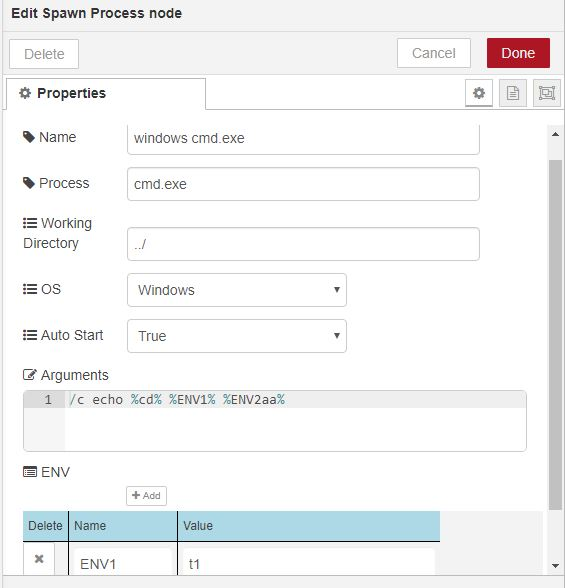

Test example:

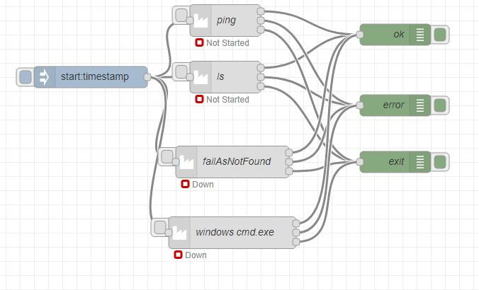

------------------------------------------------------------

## Install

Run the following command in the root directory of your Node-RED install

    npm install node-red-contrib-prib-functions

## Tests

Test/example flow in test/generalTest.json

------------------------------------------------------------

## DC DLLM - Decision-Centric Design for LLM Systems

A decision-making node that implements the Decision-Centric Design for LLM Systems architecture. It analyzes query signals and makes intelligent routing decisions for LLM interactions.

### Features

* **Signal Estimation**: Analyzes query characteristics (length, complexity, keywords, etc.)
* **Bayesian Decision Making**: Probabilistic action selection with configurable priors
* **Reinforcement Learning**: Q-learning based policy that learns from feedback
* **Sequential Context**: Maintains conversation history for consistent decisions
* **Chain-of-Thought**: Encourages step-by-step reasoning in responses
* **Tree-of-Thoughts**: Explores multiple reasoning paths for complex queries
* **Failure Attribution**: Detailed diagnostics for decision analysis

### Configuration

* **Max Length**: Maximum query length threshold
* **Keywords**: Array of keywords that trigger specific actions
* **Thresholds**: Complexity, sentence, and word count thresholds
* **Bayesian Priors**: Initial probabilities for each action
* **Sequential Mode**: Enable context-aware decision making
* **RL Policy Learning**: Use reinforcement learning for decisions
* **Reasoning Mode**: None, Chain-of-Thought, or Tree-of-Thoughts

### Outputs

1. **Answer**: Direct response generation
2. **Clarify**: Request more information from user
3. **Retrieve**: Search knowledge base
4. **Escalate**: Route to human intervention

### Usage

Send queries via `msg.payload`. The node analyzes signals and routes to appropriate output port. For RL learning, provide feedback via `msg.feedback` (1 for positive, -1 for negative).

Example flow available in `example_flow.json`.

------------------------------------------------------------

## Version
0.27.1 add file systen

0.27.0 Add DC DLLM node - Decision-Centric Design for LLM Systems with Bayesian decision making, RL policy learning, and advanced reasoning modes

0.26.0 add columnar store node with sql query capabilty

0.24.0 add in logistic regression

0.23.3 Removes bug in test, more translation

0.23.0 Removes bug in test, more translation

0.22.0 Add autocovariance + autocorealationship to real time data analystics, improves test

0.21.0 Add lag/seasonal to real time data analystics

0.20.3 Add difference + monitor system

0.19.0 Improve load injector, fix bug in test comparing buffers, add compression tranforms

0.18.0 Add matrix node

0.17.0 Add finished wire to load injector

## Author

[Peter Prib][3]

[1]: http://nodered.org "node-red home page"

[2]: https://www.npmjs.com/package/node-red-contrib-prib-functions "source code"

[3]: https://github.com/peterprib "base github"

[4]: https://github.com/NaturalIntelligence/fast-xml-parser "fast-xml-parser"

[5]: https://www.npmjs.com/package/snappy "snappy"

[6]: https://www.npmjs.com/package/avsc "avsc"

[7]: https://www.npmjs.com/package/xlsx "xlsx"
