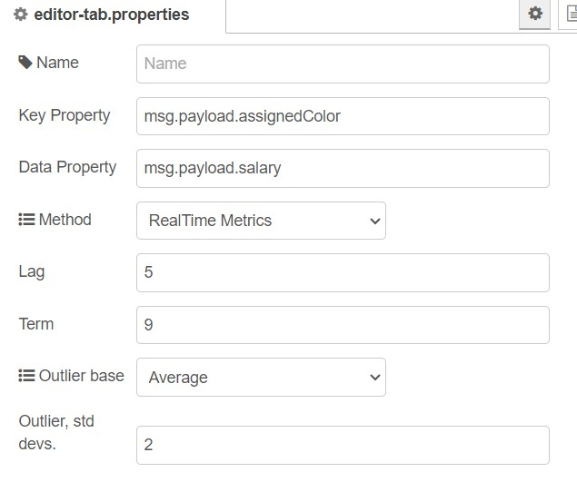
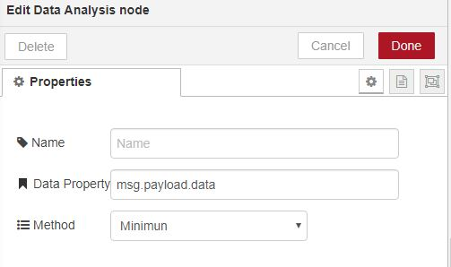
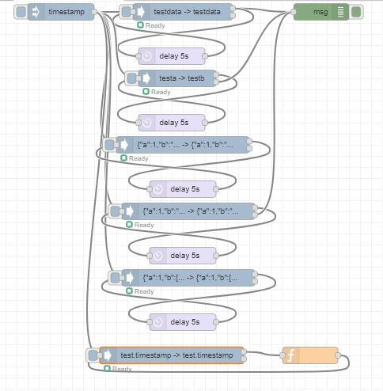

# [node-red-contrib-prib-functions][2]

[Node-Red][1] nodes for various functions:

*   Data Analysis  - statistical metrics that has real time option
*	Test  
*   Load Injector
*	Monitor Flow
*	append
*	Spawn Process
*	Host Available
*	node.js os metrics

------------------------------------------------------------

## Data Analysis

Real time metrics which are recalculated on single of data point and posted in msg.result.
Key and value can be selected from msg.payload.
Sending message with topic"@stats" places message with all stats on second port.
If realtime metrics then a third port is shown where the message is sent if it is an outlier
being outside 3 standard deviations from mean. 

A set of data analysis functions that can be run over an array of data

Single value metrics:
* Average/Mean
* Maximum
* Median
* Minimum
* Range
* Standard Deviation
* Skewness
* Sum
* Variance

Array metrics:
* Deltas
* Deltas Normalised
* Moving Average Simple (SMA)
* Moving Average Cumulative (CMA)
* Moving Average Weighted (WMA)
* Moving Average Exponential (EMA/EWMA)
* Normalise
* Standardization (Z-score Normalization)

example:

------------------------------------------------------------

## Test

Allows a test case for a message to allow simple testing of nodes. Injects a new message via mouse or message. Message sent to first port which can be consumed by other nodes and returned back to node in a loop. The Test node then checks against detailed expected payload result. 

example:

after run

------------------------------------------------------------

## append

Append file(s) to payload. Cached to maximise performance.
Require can be used to find file.

Test example:

------------------------------------------------------------

## Load Injector

Inject messages for a set period of time with varying think time.
Primary purpose is testing and useful for load/stress testing.

Test example:

------------------------------------------------------------

## Monitor Flow

Add on wire between two flows to see message rates in status line.
Rate sampled every second and provides rate last second / 10 seconds / 1 minute / 5 minutes.

Test example:

------------------------------------------------------------

## Spawn Process

Spawn process as per node.js manual with ability to set working directory, environment variables
and argument passed to process. STDOUT and STDERR are sent as individual messages.
RC port is sent a message on closure.
Takes in messages that starts a process with ability to add environment values.
Message can be sent to kill the process.    

Test example:

------------------------------------------------------------

## Host Available

Test if host is available sending msg to up or down port so action can be taken.
Message only sent on state change or if message is sent which doesn't have topic refreshHostAvailable.
This topic forces a check rather than time check which can be set.

Test example:

------------------------------------------------------------

## os

The metrics from node.js os

Test example:

------------------------------------------------------------

# Install

Run the following command in the root directory of your Node-RED install

    npm install node-red-contrib-prib-functions

# Tests

Test/example flow in test/generalTest.json

------------------------------------------------------------

# Version

0.9.3 Outlier allowed to set number of deviations

0.9.1 Add outlier detection

0.9.0 Add Pearson R realtime metrics

0.8.1 Add the tests for realtime metrics

0.8.0 Add realtime metrics to data analysis

0.7.1
* fix json to table html and minor code improvements.
turn off debug mode on spawn process.
clear down timer on close for host available

0.7.0
* add Host Available

0.6.0
* add Spawn Process
* improve experimental transform with json to table html

0.5.0
* test node add select property tested for result
* dataAnalysis add property analysed 
* add experimental transform

0.4.0 Add test, monitor flow, data analysis

0.0.1 base

# Author

[Peter Prib][3]

[1]: http://nodered.org "node-red home page"

[2]: https://www.npmjs.com/package/node-red-contrib-prib-functions "source code"

[3]: https://github.com/peterprib "base github"
