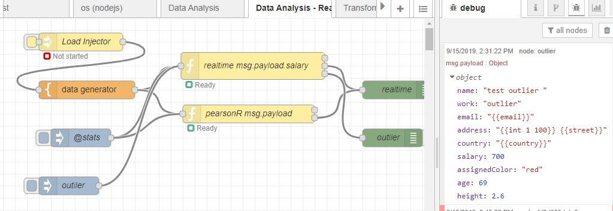
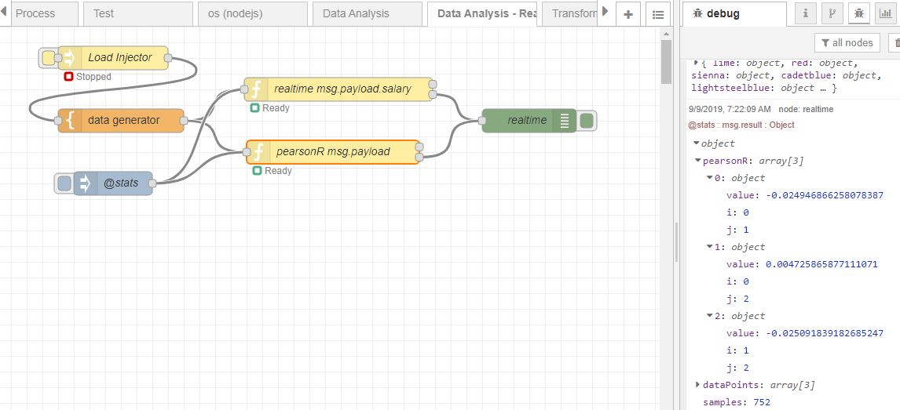
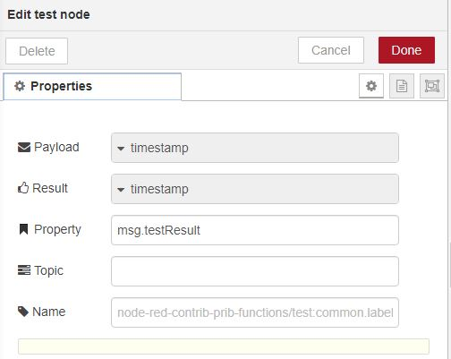

# [node-red-contrib-prib-functions][2]

[Node-Red][1] nodes for various functions:

*   Data Analysis  - statistical metrics that has real time option
*   Matrix
*	Transform
*	Test
*   Load Injector
*	Monitor Flow
*	append
*	Spawn Process
*	Host Available
*	node.js os metrics
*	Levenshtein Distance

------------------------------------------------------------

## Data Analysis

Real time metrics which are recalculated on single of data point and posted in msg.result.
Key and value can be selected from msg.payload.
Sending message with topic"@stats" places message with all stats on second port.
If realtime metrics then a third port is shown where the message is sent if it is an outlier
being outside 3 standard deviations from mean. This can be changed to median and number of deviations.

A set of data analysis functions that can be run over an array of data

Single value metrics:
* Average/Mean
* Maximum
* Median
* Minimum
* Range
* Standard Deviation
* Skewness
* Sum
* Variance

Array metrics:
* Deltas
* Deltas Normalised
* Moving Average Simple (SMA)
* Moving Average Cumulative (CMA)
* Moving Average Weighted (WMA)
* Moving Average Exponential (EMA/EWMA)
* Normalise
* Standardization (Z-score Normalization)

Array data
* distances 
* minimum distance(s) between points
* maximum distance(s) between points

example:

------------------------------------------------------------

## Matrix

Define a matrix and perform various functions

 * Define / Define Empty / Create / Create Like/ clone"
 * Add / Add Row to Row / Add to Cell / Add Row / Subtract Cell
 * Multiple / Multiple Cell / Divide Cell / Divide Row
 * Transpose
 * Adjoint
 * Cofactor
 * Complement Minor
 * Identity
 * Inverse
 * Determinant
 * Backward Substitution
 * Forward Elimination
 * Gaussian Elimination
 * Reduced Row EchelonForm
 * Row Echelon Form
 * Nearly Equals / Is Square / Get Cell
 * Sum Row
 * Swap Rows
 * To Array Object

------------------------------------------------------------

## Transform

Translates a selected msg property to a target property.
Messages generates a message for each row or record. 

Transformations:

*	Array to CSV
*	Array to HTML
*	Array to ISO8385
*	Array to Messages
*	Array to xlsx / xlsx object (excel uses [xlsx][7])  
*	AVRO to JSON (uses [avsc][6]) 
*	Confluence to JSON
*	CSV to Array
*	CSV to HTML
*	CSV to Messages
*	CSVWithHeader to Array
*	CSVWithHeader to HTML
*	CSVWithHeader to JSON
*	ISO8385 to Array
*	ISO8385 to JSON
*	JSON to Array
*	JSON to Confluence
*	JSON to CSV
*	JSON to AVRO (uses [avsc][6])
*	JSON to ISO8385
*	JSON to Messages
*	JSON to String
*	JSON to xlsx / xlsx object (excel uses [xlsx][7])  
*	JSON to XML (uses [fast-xml-parser][4])
*	String to JSON
*	path to Basename
*	path to Dirname
*	path to Extname
*	path to Format
*	path to Is Absolute
*	path to Join
*	path to Parse
*	path to Normalize
*	path to Resolve
*	snappy compress (uses [snappy][5], must install separately)
*	snappy uncompress (uses [snappy][5], must install separately)
*	xlsx / xlsx object to array/JSON (excel uses [xlsx][7])  
*	XML to JSON (uses [fast-xml-parser][4])

Note, snappy needs to be installed separately as can have issues with auto install as build binaries.

With xlsx object one can use the function in [xlsx][7] against the object in functions node.

Example AVRO with schema

For Confluence schema contains a list of schemas in form {"<schema id>",<schema>}

------------------------------------------------------------

## Test

Allows a test case for a message to allow simple testing of nodes. Injects a new message via mouse or message. Message sent to first port which can be consumed by other nodes and returned back to node in a loop. The Test node then checks against detailed expected payload result. 

example:

after run

------------------------------------------------------------

## append

Append file(s) to payload. Cached to maximise performance.
Require can be used to find file.

Test example:

------------------------------------------------------------

## Levenshtein Distance

The levenshtein distance between two character strings.

------------------------------------------------------------

## Load Injector

Inject messages for a set period of time with varying think time.
Primary purpose is testing and useful for load/stress testing.

Test example:

------------------------------------------------------------

## Monitor Flow

Add on wire between two flows to see message rates in status line.
Rate sampled every second and provides rate last second / 10 seconds / 1 minute / 5 minutes.

Test example:

------------------------------------------------------------

## Spawn Process

Spawn process as per node.js manual with ability to set working directory, environment variables
and argument passed to process. STDOUT and STDERR are sent as individual messages.
RC port is sent a message on closure.
Takes in messages that starts a process with ability to add environment values.
Message can be sent to kill the process.    

Test example:

------------------------------------------------------------

## Host Available

Test if host is available sending msg to up or down port so action can be taken.
Message only sent on state change or if message is sent which doesn't have topic refreshHostAvailable.
This topic forces a check rather than time check which can be set.

Test example:

------------------------------------------------------------

## os

The metrics from node.js os

Test example:

------------------------------------------------------------

# Install

Run the following command in the root directory of your Node-RED install

    npm install node-red-contrib-prib-functions

# Tests

Test/example flow in test/generalTest.json

------------------------------------------------------------

# Version

0.18.0 Add matrix node

0.17.0 Add finished wire to load injector

0.16.10 data analysis add eulcidean distance functions. Add array pairs

0.16.0 fix data analysis variance and stddev, add sample, add tests

0.14.2 fix general test flows. Add icon for data analysis

0.14.1 fix capitalization issue with levenshtein Distance

0.14.0 add xlsx transformer

0.13.0 Confluence AVRO message converter

0.12.0 added xml to json and json to xml.  Make snappy installed separately as can cause install issues 

0.11.1 Fix spelling of AVRO. 

0.11.0 Transform for AVRO and snappy.  Add JSON to CSV 

# Author

[Peter Prib][3]

[1]: http://nodered.org "node-red home page"

[2]: https://www.npmjs.com/package/node-red-contrib-prib-functions "source code"

[3]: https://github.com/peterprib "base github"

[4]: https://github.com/NaturalIntelligence/fast-xml-parser "fast-xml-parser"

[5]: https://www.npmjs.com/package/snappy "snappy"

[6]: https://www.npmjs.com/package/avsc "avsc"

[7]: https://www.npmjs.com/package/xlsx "xlsx"
