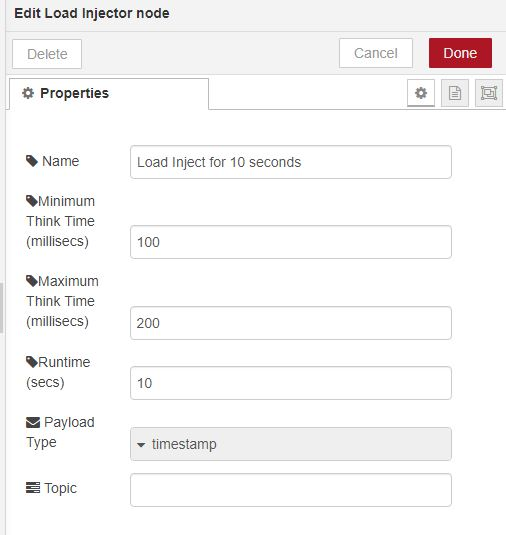

# node-red-contrib-prib-functions

[Node-Red][1] nodes for various functions.

## append

append file(s) to payload.

## Load Injector 

Inject messages for a set period of time with varying think time.
Primary purpose is testing and useful for load/stress testing.

# Install

Run the following command in the root directory of your Node-RED install

    npm install node-red-contrib-prib-functions

# Author

[Peter Prib][3]

[1]: http://nodered.org "node-red home page"

[2]: https://www.npmjs.com/package/node-red-contrib-prib-functions "source code"

[3]: https://github.com/peterprib "base github"
